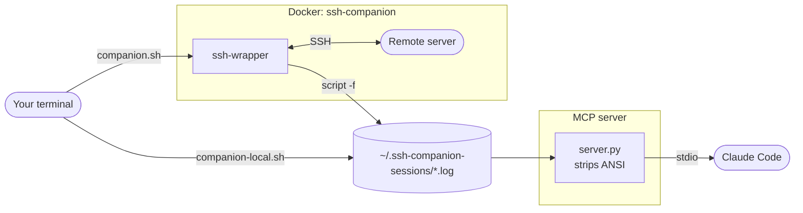

# ssh-companion


> "I am always here if you need me, though I confess I find the most enjoyment in simply observing."
> — *Daneel Olivaw, The Caves of Steel* (Isaac Asimov)

An MCP server that lets Claude observe your SSH and local shell sessions in real time and advise on support problems — performance issues, log analysis, error detection — without touching anything.

## How it works

A Docker container acts as the SSH chokepoint. Every session you open through the container is silently captured via `script` to a log file. Local sessions are captured the same way, directly on the host. The MCP server reads those logs and exposes them to Claude. Works with nested tmux on the remote, any shell, any terminal — capture happens at the raw byte stream level.



## Prerequisites

- Docker
- screen (Linux) or Windows Terminal / `wt` (Windows)
- [Claude Code CLI](https://claude.ai/code)

## Setup

### 1. Start the container

Pull the pre-built image from GitHub Container Registry and run it:

```bash
docker run -d --name ssh-companion \
  -v /tmp:/tmp \
  -v ~/.ssh-companion-sessions:/sessions \
  --restart unless-stopped \
  ghcr.io/gregolsky/ssh-companion:latest
```

**Alternative — build from source:**

```bash
git clone https://github.com/gregolsky/ssh-companion.git
cd ssh-companion
./start-mcp-server.sh
```

### 2. Register the MCP server with Claude Code

The launch scripts (`companion.sh`, `companion-local.sh`) do this automatically. To register manually:

```bash
claude mcp add ssh-companion docker -- exec -i ssh-companion python /app/server.py
```

Or add to `.mcp.json` in your project root for automatic registration when Claude Code opens that directory:

```json
{
  "mcpServers": {
    "ssh-companion": {
      "command": "docker",
      "args": ["exec", "-i", "ssh-companion", "python", "/app/server.py"]
    }
  }
}
```

## Usage

### SSH session (Linux)

Opens the SSH session on the left and Claude on the right, side by side.

```bash
./companion.sh ssh ubuntu@prod-db-1
./companion.sh ssh -i /tmp/temp-key ubuntu@prod-db-1
```

### SSH session (Windows)

```powershell
.\companion.ps1 ssh ubuntu@prod-db-1
.\companion.ps1 ssh -i ~\.ssh\key.pem ubuntu@prod-db-1
```

### Local shell session

Observe a local bash session — no SSH, no Docker for the capture side.

```bash
./companion-local.sh
```

Claude sees it as hostname `local`: `focus_session("local")`.

### Manual SSH (if you prefer your own terminal layout)

```bash
# Add this alias to ~/.bashrc or ~/.zshrc
alias ssh='docker exec -it ssh-companion ssh'

# Then use ssh normally — sessions are captured automatically
ssh user@prod-db-1
```

### Ask Claude for help

Once you're in a session, switch to the Claude pane and ask:

```
What's happening on prod-db-1?
```

Claude will call `focus_session("prod-db-1")` and read the last 200 lines of your session.

### Active watch mode (`/loop`)

To have Claude monitor a session and alert you proactively:

```
/loop Watch prod-db-1 every 30 seconds. Call read_session_since with the last
byte_offset each time. Alert me if you see errors, OOM messages, high load,
or anything that looks like it needs attention.
```

## MCP Tools

| Tool | Description |
|------|-------------|
| `list_sessions()` | List all captured sessions by hostname with last-active time |
| `focus_session(hostname, lines=200)` | Read the latest session log — returns clean text + byte_offset |
| `read_session_since(hostname, byte_offset)` | Efficient poll — only new output since last read |
| `search_session(hostname, pattern)` | Grep all logs for a hostname using a Python regex |

## Multiple servers

Each server gets its own log file(s) under `~/.ssh-companion-sessions/<hostname>-<timestamp>.log`. Switching between servers just means telling Claude a different hostname — it reads the right log automatically.

```
# You were on prod-db-1, now you're jumping to prod-web-2:
ssh user@prod-web-2

# In Claude:
"I'm now on prod-web-2 — what do you see?"
```

## Stopping / cleanup

```bash
# Stop the container
docker stop ssh-companion && docker rm ssh-companion

# Clear session logs (optional)
rm -rf ~/.ssh-companion-sessions
```

## Notes

- **Read-only**: Claude can only observe. No commands are sent to any session.
- **Nested tmux**: works fine. The capture is at the SSH byte stream level, so what remote tmux renders is captured as-is and ANSI-stripped for Claude.
- **No prefix clash**: `companion.sh` uses GNU `screen` locally (prefix `C-a`), so `C-b` passes cleanly through to your remote tmux session.
- **SSH keys**: the `/tmp:/tmp` mount means any key at `/tmp/temp-key` on the host is visible inside the container at the same path — use `ssh -i /tmp/temp-key` as normal. SSH agent forwarding (`-A`) is also supported.
