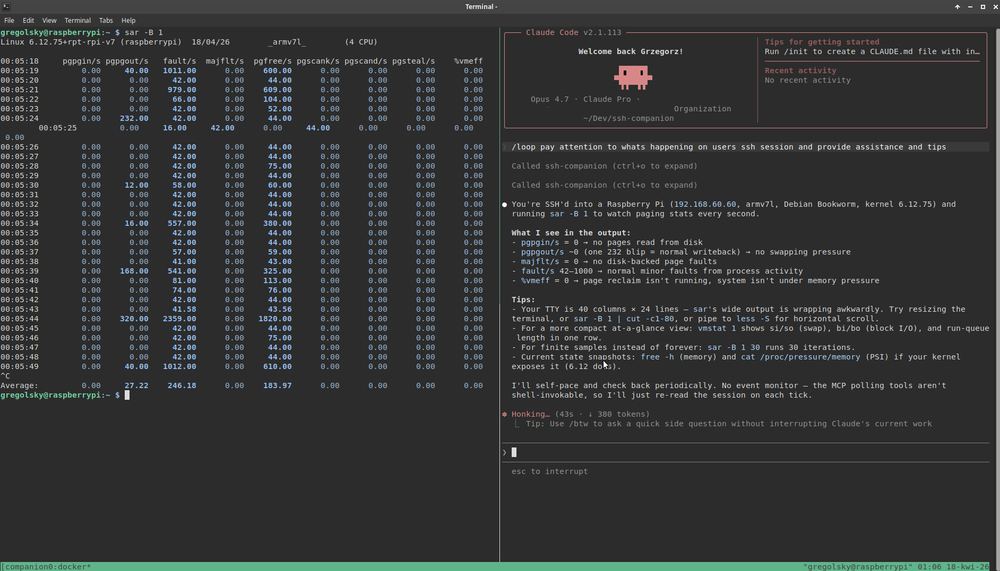

# ssh-companion

<p align="center">

</p>

> "I am always here if you need me, though I confess I find the most enjoyment in simply observing."
> — *Daneel Olivaw, The Caves of Steel* (Isaac Asimov)

An MCP server that lets Claude observe your SSH and local shell sessions in real time and advise on support problems — performance issues, log analysis, error detection — without touching anything.

## 🍭 How it looks

<p align="center">

</p>

## 🔍 How it works

A Docker container acts as the SSH chokepoint. Every session you open through the container is silently captured via `script` to a log file. Local sessions are captured the same way, directly on the host. The MCP server reads those logs and exposes them to Claude. Works with nested tmux on the remote, any shell, any terminal — capture happens at the raw byte stream level.


## 📋 Prerequisites

- Docker
- tmux (Linux) or Windows Terminal / `wt` (Windows)
- [Claude Code CLI](https://claude.ai/code)

## 🚀 Setup

### 1. Start the container

Pull the pre-built image from GitHub Container Registry and run it:

```bash
docker run -d --name ssh-companion \
  -v ~/.ssh:/home/companion/.ssh \
  -v ~/.ssh-companion-sessions:/sessions \
  --restart unless-stopped \
  ghcr.io/gregolsky/ssh-companion:latest
```

**About the key mount:** `ssh` runs *inside* the container as a non-root `companion` user, so it can only read keys that are visible inside the container. The `-v ~/.ssh:/home/companion/.ssh` line above mounts your host SSH directory at the companion user's home — your usual keys (`id_ed25519`, `id_rsa`, etc.) and `known_hosts` are picked up as normal, and new hosts can be written back to `known_hosts`. Add `:ro` to the mount if you want to keep it read-only (note: this breaks first-time host-key acceptance).

**UID caveat:** the prebuilt image pins `companion` to UID/GID 1000, which matches most single-user Linux desktops. If `id -u` on your host isn't 1000, the container won't be able to read your keys or write session logs — build from source instead:

```bash
git clone https://github.com/gregolsky/ssh-companion.git
cd ssh-companion
./build.sh        # picks up your host UID/GID automatically
```

If your keys live elsewhere, mount that directory instead (or in addition). Examples:

```bash
# Throwaway key at /tmp/temp-key on the host:
-v /tmp:/tmp

# Project-local keys under ~/work/keys:
-v ~/work/keys:/home/companion/keys:ro     # then: ssh -i /home/companion/keys/<name> user@host
```

Prefer not to mount keys at all? Start your SSH agent on the host, forward it with `-A` (`./companion.sh ssh -A user@host`), and the container uses your agent over the forwarded socket.

**Alternative — build from source:**

```bash
git clone https://github.com/gregolsky/ssh-companion.git
cd ssh-companion
./start-mcp-server.sh
```

### 2. MCP server registration

The launch scripts manage this automatically. Each time you run `companion.sh` or `companion-local.sh` a uniquely-named entry is added to the project-local `.mcp.json`:

```
ssh-companion-prod-db-1-12345   →  scoped to prod-db-1
ssh-companion-staging-67890     →  scoped to staging
```

The entry is removed automatically when you close the session (tmux pane or terminal window). Stale entries left behind by `kill -9` or power loss are pruned the next time a companion script runs.

Because `.mcp.json` is runtime-managed it is gitignored. You should open Claude Code **from within the `ssh-companion` directory** (or a directory that contains its `.mcp.json`) so the project-scoped file is loaded. If you open Claude separately before launching a companion script it will not see the MCP entry.

Each MCP instance is scoped to one SSH host, so Claude's tools (`focus_session`, `read_session_since`, `search_session`) work without specifying a hostname — they automatically target the right server. When working with multiple servers at once, Claude can call tools on different instances simultaneously.

## 💻 Usage

### SSH session (Linux)

Opens the SSH session on the left and Claude on the right, side by side.

```bash
# Default keys from ~/.ssh (works out of the box if you used the mount
# from the Setup step above):
./companion.sh ssh ubuntu@prod-db-1

# Specific key — the path is resolved inside the container, so the
# directory must be mounted (see "About the key mount" above):
./companion.sh ssh -i /home/companion/.ssh/work_key ubuntu@prod-db-1

# Agent forwarding — no key mount needed:
./companion.sh ssh -A ubuntu@prod-db-1
```

### SSH session (Windows)

```powershell
.\companion.ps1 ssh ubuntu@prod-db-1
.\companion.ps1 ssh -i ~\.ssh\key.pem ubuntu@prod-db-1
```

### Local shell session

Observe a local bash session — no SSH, no Docker for the capture side.

```bash
./companion-local.sh
```

Claude sees it as hostname `local`. The MCP server still runs inside the `ssh-companion` container, so the container must be running before launching `companion-local.sh`. The script will start it automatically if it isn't already running.

### Layout options

Both `companion.sh` and `companion-local.sh` accept:

- `--split` (default) — tmux side-by-side pane (prefix remapped to `C-q`)
- `--windows` — two separate terminal windows

`--windows` auto-detects the terminal emulator (gnome-terminal, konsole, alacritty, kitty, wezterm, xfce4-terminal, xterm, or the Debian `x-terminal-emulator` alternative). Override with `COMPANION_TERMINAL_APP`:

```bash
COMPANION_TERMINAL_APP=alacritty ./companion.sh --windows ssh user@host
```

If tmux is missing and no layout is specified, the scripts fall back to `--windows` automatically. On Windows, `companion.ps1` supports `-Split` / `-Windows` switches.

### Manual SSH (if you prefer your own terminal layout)

```bash
# Add this alias to ~/.bashrc or ~/.zshrc
alias ssh='docker exec -it ssh-companion ssh'

# Then use ssh normally — sessions are captured automatically
ssh user@prod-db-1
```

### Ask Claude for help

Once you're in a session, switch to the Claude pane and ask:

```
What's happening on prod-db-1?
```

Claude will call `focus_session("prod-db-1")` and read the last 200 lines of your session.

### Active watch mode (default)

By default, every `companion.sh` and `companion-local.sh` launch boots Claude into a `/loop` that watches the session every ~60s and advises on what the user is doing — errors, non-zero exits, OOM messages, high load, stack traces.

To disable it:

```bash
./companion.sh --no-watch ssh ubuntu@prod-db-1
./companion-local.sh --no-watch
```

To override the default watcher with a custom prompt, use `--instructions-loop`:

```bash
./companion.sh --instructions-loop "Watch prod-db-1 every 30 seconds. \
Call read_session_since with the last byte_offset each time. \
Alert me if you see errors, OOM messages, or high load." \
ssh ubuntu@prod-db-1
```

Works the same with `companion-local.sh`. Flags must come before the `ssh` subcommand.

### Performance checklist (`/ssh-perf`)

Type `/ssh-perf` in the Claude pane to start a guided walkthrough of Brendan Gregg's 60-second Linux performance checklist. Claude presents each command for you to paste in the left pane, reads the output via `read_session_since`, interprets the key fields (CPU saturation, I/O wait, swap pressure, TCP errors), and tracks a progress checklist across the session. After all 10 steps it summarizes the top bottlenecks and suggests follow-up commands.

## 🛠️ MCP Tools

| Tool | Description |
|------|-------------|
| `list_sessions()` | List all captured sessions by hostname with last-active time |
| `focus_session(hostname, lines=200)` | Read the latest session log — returns clean text + byte_offset |
| `read_session_since(hostname, byte_offset)` | Efficient poll — only new output since last read |
| `search_session(hostname, pattern)` | Grep all logs for a hostname using a Python regex |

## 🖥️ Multiple servers

Each server gets its own log file(s) under `~/.ssh-companion-sessions/<hostname>-<timestamp>.log`. Switching between servers just means telling Claude a different hostname — it reads the right log automatically.

```
# You were on prod-db-1, now you're jumping to prod-web-2:
ssh user@prod-web-2

# In Claude:
"I'm now on prod-web-2 — what do you see?"
```

## 🛡️ Threat model

### What ssh-companion defends against

- **Container escape / privilege escalation inside the container.** The container runs as a non-root `companion` user with `--cap-drop=ALL` and `--security-opt=no-new-privileges`. A compromised process can't use Linux capabilities or setuid binaries to elevate.
- **Stale upstream CVEs.** CI runs Trivy on every PR and weekly to flag fixable HIGH/CRITICAL findings in the base image, and Dependabot nudges updates for the Dockerfile base image and GitHub Actions.
- **Tampering with the MCP server or ssh wrapper binaries.** The container is built from source on every release — there's no writable persistence layer that survives a rebuild.

### What's out of scope

- **Host trust.** ssh-companion assumes the host is trusted. `~/.ssh` is bind-mounted into the container (read-write by default so `known_hosts` updates work), so a compromised container still has access to your keys. If that's not acceptable, add `:ro` to the mount and accept the TOFU-verification friction.
- **The SSH target itself.** Whatever the user types in the session hits the remote as-is. The tool observes; it does not filter, rate-limit, or sanitize.
- **Session log confidentiality.** Logs capture the raw session byte stream, including anything typed into interactive prompts (passwords, tokens, sudo inputs). They live at `~/.ssh-companion-sessions/` with host filesystem permissions — anyone with read access to that directory can replay them.
- **MCP access control.** Any process on the host that can `docker exec` into the container can invoke the MCP tools and read every captured session. Claude's tool access is not sandboxed beyond that.
- **Supply chain of `mcp[cli]` and base image.** Trivy scans known CVEs, but zero-days and compromised upstream packages are not detected.

## 🧹 Stopping / cleanup

Session MCP entries are removed automatically when you close the companion window. Entries from abruptly terminated sessions are pruned the next time any companion script runs.

To recover manually (e.g. after a system restart with stale entries):

```bash
# Remove all ssh-companion-* entries from .mcp.json
jq 'del(.mcpServers | with_entries(select(.key | startswith("ssh-companion-"))))' \
    .mcp.json > /tmp/mcp.json && mv /tmp/mcp.json .mcp.json

# Stop the container
docker stop ssh-companion && docker rm ssh-companion

# Clear session logs (optional)
rm -rf ~/.ssh-companion-sessions
```

## 📝 Notes

- **Read-only**: Claude can only observe. No commands are sent to any session.
- **Nested tmux**: works fine. The capture is at the SSH byte stream level, so what remote tmux renders is captured as-is and ANSI-stripped for Claude.
- **No prefix clash**: `companion.sh` runs tmux on a dedicated socket with the prefix remapped to `C-q`, so `C-b` passes cleanly through to your remote tmux session. Use `C-q` as the local prefix (e.g. `C-q d` to detach, `C-q o` to switch panes).
- **SSH keys**: `ssh` runs inside the container as a non-root `companion` user, so it can only read keys mounted into the container (default: `-v ~/.ssh:/home/companion/.ssh`). Agent forwarding (`-A`) works too — see the Setup section for details, including the UID caveat.
